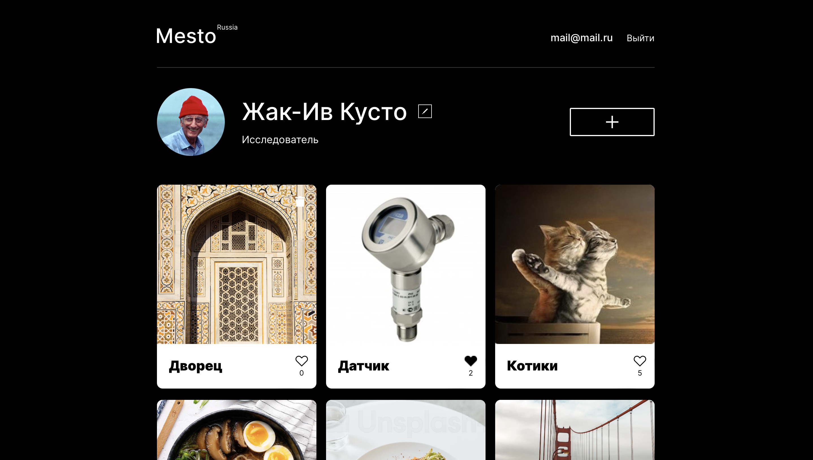

<h1 align="center">Mesto. Опыт путешественников</h1>
<h2 align="center">Проектная работа в рамках обучения на Я.Практикуме</h2>

<h2 align="center"> Используемые технологии &#128187;</h2>

- JavaScript
- React.js
- Git
- Express.js
- mongoDB
- HTML
- CSS

<h2 align="center">Описание проекта &#128444</h2>

Проект представляет собой сервис, в котором "путешественники" делять своими картинками из разных мест планеты.

Пользователю доступен ряд функционала - регистрация и авторизация пользователя, добавления новой карточки с помощью названия места и ссылки на изображение, удаление добавленной картинки, возможность поставить лайк или удалить, а также изменение аватара пользователя, его имя и описание или же выйти из аккаунта.

Данный репозиторий объединяет в себе фронтенд и бэкенд проекта, которые по отдельности также представлены в других репозиториях.

Бэкенд расположите в директории `backend/`, а фронтенд - в `frontend/`. 

<h2 align="center"> Инструкция по развертыванию &#128212;</h2>

Хотите попробовать в использовании данный ресурс?

1. Клонируйте данный репозиторий локально
2. Перейдите в папку `frontend/`
3. В документах `/src/utils/Api.js` и `/src/utils/auth.js` на строках 104 и 57 соотвественно замените baseUrl на "http://localhost:3001"
4. В другом терминале перейдите в папку `backend/`
5. Запустите бэкенд командой npm run dev
6. Запустите фронтенд командой npm run start
7. Наслаждайтесь функционалом &#127881;

<h2 align="center"> Планы по доработке проекта &#128221; </h2>

- Автоматический вход в аккаунт при регистрации пользователя
- Возможность восстановления утраченного пароля, его сброса через электронную почту
- Закрытие модальных окон при клике на overlay
- Возможность изменение уже добавленных ранее мест

<h2 align="center"> Дополнительная информация &#128222;</h2>

- Публичный IP 158.160.55.233
- [Ссылка на фронтенд (ограниченный срок гранта - может не работать)](https://mariarez.nomoredomains.club)
- [Ссылка на бэкенд (ограниченный срок гранта - может не работать)](https://api.mariarez.nomoredomains.club)
- [Ссылка на репозиторий с фронтендом](https://github.com/MariaRez/react-mesto-auth)
- [Cсылка на репозиторий с бэкендом](https://github.com/MariaRez/express-mesto-gha)
